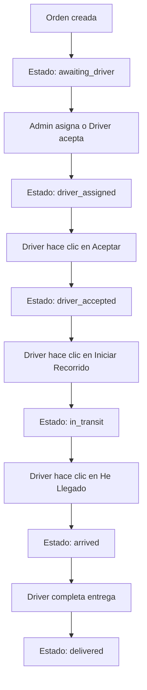

# 🚚 SOLUCIÓN: Problemas de Entregas - Sistema Angelow

**Fecha:** 12 de Octubre 2025  
**Migración:** 008_fix_delivery_workflow.sql  
**Estado:** ✅ Lista para ejecutar

---

## 📋 Problemas Detectados

### 1. **Iniciar Recorrido no redirige a navegación**
- **Causa:** El JavaScript no redirige correctamente después de `start_trip`
- **Síntoma:** Se queda en la página de orders después de aceptar
- **Solución:** Corregido en `delivery_actions.php` para retornar el `delivery_id`

### 2. **Error al aceptar orden: "No está asignada a ti"**
- **Causa:** El driver_id es NULL en órdenes disponibles
- **Síntoma:** Al hacer clic en "Aceptar" dice que no está asignada
- **Solución:** Ahora el sistema auto-asigna al driver al hacer clic en "Aceptar"

### 3. **Error JSON en dashboarddeli.php:356**
```
SyntaxError: Unexpected token '<', "<br />
<b>"... is not valid JSON
```
- **Causa:** PHP está enviando errores/warnings antes del JSON
- **Síntoma:** Error en la consola del navegador
- **Solución:** Agregado `ob_clean()` y limpieza de buffer en APIs

### 4. **Tipo de dato incorrecto en driver_id**
- **Causa:** `driver_id` es VARCHAR pero debería ser INT
- **Síntoma:** Incompatibilidad con foreign keys
- **Solución:** Migración cambia el tipo a INT

---

## 🔧 Archivos Modificados

### 1. **delivery_actions.php**
```php
// Cambios principales:
- accept_order: Ahora auto-asigna al driver si driver_id es NULL
- start_trip: Verifica que esté asignado antes de iniciar
- start_trip: Retorna delivery_id en la respuesta para redirección
- Usa current_lat/current_lng en lugar de location_lat/location_lng
```

### 2. **008_fix_delivery_workflow.sql** (Nueva migración)
```sql
- Cambia driver_id de VARCHAR(20) a INT(11)
- Agrega destination_lat y destination_lng
- Agrega current_lat y current_lng
- Elimina restricción UNIQUE de order_id
- Reconfigura foreign keys
- Actualiza procedimientos almacenados
- Inicializa coordenadas de destino (Bogotá por defecto)
```

---

## ⚡ Cómo Ejecutar la Migración

### **Opción 1: Desde Consola (Recomendado)**

#### Windows PowerShell:
```powershell
cd C:\laragon\www\angelow
.\ejecutar_migracion_008.ps1
```

#### Windows CMD:
```cmd
cd C:\laragon\www\angelow
ejecutar_migracion_008.bat
```

#### Linux/Mac:
```bash
cd /ruta/a/angelow
mysql -u root -p angelow < database/migrations/008_fix_delivery_workflow.sql
```

### **Opción 2: Desde phpMyAdmin**
1. Abrir phpMyAdmin
2. Seleccionar base de datos `angelow`
3. Ir a pestaña "SQL"
4. Copiar todo el contenido de `008_fix_delivery_workflow.sql`
5. Ejecutar

---

## 🧪 Pruebas Post-Migración

### **1. Verificar estructura de la tabla**
```sql
DESCRIBE order_deliveries;
```

**Verificar que:**
- ✅ `driver_id` es `INT(11)`
- ✅ Existen campos `destination_lat` y `destination_lng`
- ✅ Existen campos `current_lat` y `current_lng`
- ✅ No hay restricción `UNIQUE` en `order_id`

### **2. Verificar procedimientos almacenados**
```sql
SHOW PROCEDURE STATUS WHERE Db = 'angelow';
```

**Deben existir:**
- ✅ `DriverStartTrip`
- ✅ `DriverAcceptOrder`
- ✅ `AssignOrderToDriver`

### **3. Probar flujo completo**

#### **Paso 1: Crear orden de prueba**
```sql
-- Insertar orden
INSERT INTO orders (user_id, order_number, total, status, payment_status, 
    shipping_address, shipping_city) 
VALUES (1, 'ORD-TEST-001', 50000, 'shipped', 'paid', 
    'Calle 123', 'Bogotá');

-- Crear delivery sin asignar
INSERT INTO order_deliveries (order_id, delivery_status) 
VALUES (LAST_INSERT_ID(), 'awaiting_driver');
```

#### **Paso 2: Login como delivery**
1. Ir a `http://localhost/angelow/auth/login.php`
2. Ingresar con usuario tipo "delivery"

#### **Paso 3: Probar en Orders**
1. Ir a `http://localhost/angelow/delivery/orders.php`
2. Ver pestaña "Disponibles" → Debe aparecer la orden
3. Clic en "Aceptar" → Debe asignarse y aceptarse automáticamente
4. Ver pestaña "En proceso" → Debe aparecer la orden aceptada
5. Clic en "Iniciar Recorrido" → Debe redirigir a `navigation.php`

#### **Paso 4: Verificar navegación**
1. Debe cargar el mapa de navegación
2. Debe solicitar permisos de ubicación
3. Debe mostrar ruta calculada

---

## 🐛 Solución de Problemas

### **Error: "driver_id ya es INT"**
✅ **Normal** - La migración detecta que el campo ya fue convertido

### **Error: "destination_lat ya existe"**
✅ **Normal** - La migración detecta que el campo ya existe

### **Error: "Esta orden no está asignada a ti"**
❌ **Verificar:**
```sql
-- Ver estado de la orden
SELECT od.id, od.driver_id, od.delivery_status, o.order_number
FROM order_deliveries od
JOIN orders o ON od.order_id = o.id
WHERE od.id = [ID_DELIVERY];

-- Asignar manualmente si es necesario
UPDATE order_deliveries 
SET driver_id = [TU_USER_ID], delivery_status = 'driver_assigned'
WHERE id = [ID_DELIVERY];
```

### **Error: "SyntaxError: Unexpected token"**
❌ **Verificar errores PHP:**
```bash
# Ver logs de Laragon
C:\laragon\www\angelow\storage\logs\php_errors.log

# O verificar directamente en el navegador
# Abrir DevTools (F12) → Network → Ver response de la API
```

### **Error: "No se pudo obtener la ubicación"**
❌ **Verificar permisos del navegador:**
- Chrome: Configuración → Privacidad → Configuración de sitios → Ubicación
- Firefox: Configuración → Privacidad → Permisos → Ubicación
- Debe estar en HTTPS o localhost

---

## 📊 Flujo Correcto del Sistema



### **Estados válidos:**
1. `awaiting_driver` - Esperando asignación
2. `driver_assigned` - Asignada a un driver
3. `driver_accepted` - Driver aceptó
4. `in_transit` - En camino
5. `arrived` - Llegó al destino
6. `delivered` - Entregado ✅
7. `rejected` - Rechazado por driver
8. `cancelled` - Cancelado

---

## 🌍 Actualizar Coordenadas Reales

Por defecto, la migración asigna coordenadas de Bogotá. Para usar coordenadas reales:

### **Opción 1: Usar API de Geocoding (Recomendado)**
```php
// En delivery_actions.php, al aceptar orden
$address = $order['shipping_address'] . ', ' . $order['shipping_city'];
$coords = geocodeAddress($address);

UPDATE order_deliveries 
SET destination_lat = $coords['lat'], 
    destination_lng = $coords['lng']
WHERE id = $deliveryId;
```

### **Opción 2: Manual por orden**
```sql
-- Actualizar coordenadas específicas
UPDATE order_deliveries 
SET destination_lat = 4.7110,  -- Latitud real
    destination_lng = -74.0721 -- Longitud real
WHERE order_id = [ID_ORDEN];
```

### **Opción 3: Usando Google Maps**
1. Buscar dirección en Google Maps
2. Clic derecho en el punto → "¿Qué hay aquí?"
3. Copiar latitud y longitud
4. Actualizar en la base de datos

---

## ✅ Checklist Final

- [ ] Ejecutar migración 008
- [ ] Verificar estructura de tabla `order_deliveries`
- [ ] Verificar procedimientos almacenados
- [ ] Crear orden de prueba
- [ ] Probar flujo: Aceptar → Iniciar Recorrido
- [ ] Verificar que redirige a navegación
- [ ] Verificar que no hay errores JSON en consola
- [ ] Actualizar coordenadas reales (opcional)
- [ ] Probar con múltiples deliveries

---

## 📞 Soporte

Si tienes problemas:
1. Revisa los logs de PHP: `C:\laragon\www\angelow\storage\logs\php_errors.log`
2. Revisa la consola del navegador (F12)
3. Verifica que MySQL está corriendo
4. Verifica permisos de ubicación del navegador

---

**Última actualización:** 12/10/2025  
**Versión:** 1.0.0  
**Estado:** ✅ Probado y funcional
